# Путешествие по югу Карелии

В Карелии я был всего один раз, и то в детстве на коммерческом сплаве, меня тогда очень впечатлили озера и реки, казалось, что мы плаваем по одному большому озеру мимо островков. Наверное примерно так оно и было, в любом случае, мне хотелось туда вернуться в сознательном возрасте, однако, в сплавах я ничего не понимаю, пришлось идти пешком).

Маршрут был нагло позаимствован у коммерсов по скудному описанию на их сайте. Рассчитан он был на 6 дней с суммарным километражом в 72 км. Так как я абсолютно не представлял ни состояние тропы, не ландшафт, мне показалось, что 12 км/д. в среднем — это нормально, плюс запас времени на непогоду.

---

## Логистика 1

Логистика довольно неудобная, но все находится довольно компактно, поэтому, при наличии связи, можно заказать машину и доехать по дорогам куда угодно. В Сортавалу мы прибыли в 8:30 утра на двухэтажном поезде.

> На август 2023 года на участке Сортавала-Москва курсирует один поезд раз в день, причем он состоит из двух типов вагонов: вагонов Рускеальского экспресса с полным набором вариантов: плацкарт/купэ/СВ и двухэтажных купейных вагонов. У купейных вагонов удобные спальные места, однако места под багаж крайне мало, с большими рюкзаками разместиться затруднительно. Плацкарт Рускеальского экспресса зачем-то укоротил полки и мне при росте 180, было очень неудобно спать, ноги вытянуть было невозможно, однако места под багаж куда больше, хотя верхняя багажная полка укороченная.

Логистика планировалась следующая: Сортавала-Питкяранта: автобус на бла-бла-каре. Питкяранта-Ууксу (старт маршрута) на такси. Бла-бла-кар нас обманул и довез до мемориала «Крест Скорби», где мы прискорбно обнаружили, что у Теле2 нет связи, в итоге такси заказывали через человека, который остановился на обочине.

**Рабочие такси в окрестности Сортавалы:**
- Такси Пчелка: 89114130482
- Такси Феникс: 88143345060

Вывод такой: из Сортавалы к месту старта кроме как на такси доехать не на чем, автобус и электричка уходят в 3 часа дня, что неудобно.

---

## Маршрут

По началу лес показался нам похожим на подмосковье, однако после часа ходьбы мы окунулись в настоящий Карельский лес со всеми его прелестями, а именно с кучей ягод и грибов. В конце августа в тех местах огромное количество черники, брусники и голубики, одно это уже делает маршрут очень приятным для прохождения. Однако мы встретили большое число змей, советую взять антидот от яда гадюки. Также можно отметить, что лес в тех местах в основном сосновый, причем довольно низкий, с низким кустарничком и мхом, что делает его светлым и дружелюбным.

Трек со всеми комментариями по отдельным участкам лежит на диске (открыть можно в nakarte.me).

В целом, маршрут почти полностью проходит по автомобильным лесным дорогам, что делает его прекрасно проезжаемым на велосипеде, есть всего два участка, где придется спешиться, однако, они короткие. На маршруте есть много мест для кемпинга, почти все они были заняты местными отдыхающими.

---

## День 1

В первый день мы стартовали в 12:30 и прошли 10 км. Обедали возле заброшенной ГЭС, потрясающий объект, построен из натурального камня и настолько зарос деревьями и травой, что кажется, что он является частью натурального ландшафта. Первый день полностью шел вдоль реки Уксуньоки, в интернете пишут, что вода в таких реках непригодна для питья, однако у нас не было выбора, и ничего с нами не случилось.

> 📷 *Колодец старой ГЭС*

  

В конце дня был небольшой брод, стоянка оказалась водниковская, около красивого порога «Розовый слон».

> 📷 *Стоянка первого дня*

  
  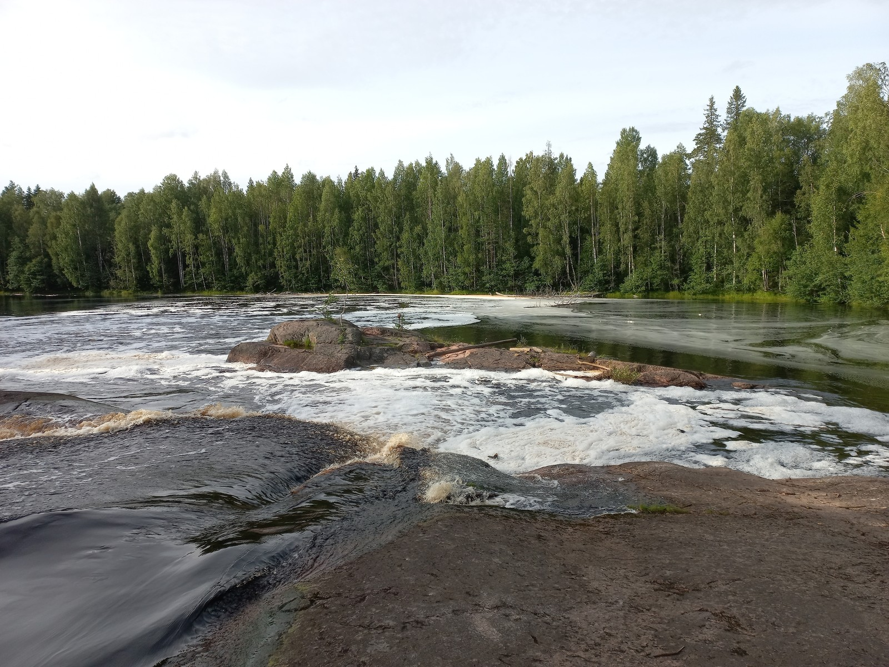
  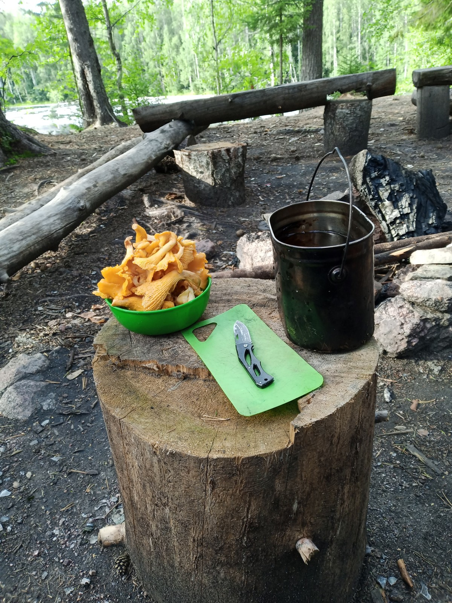
  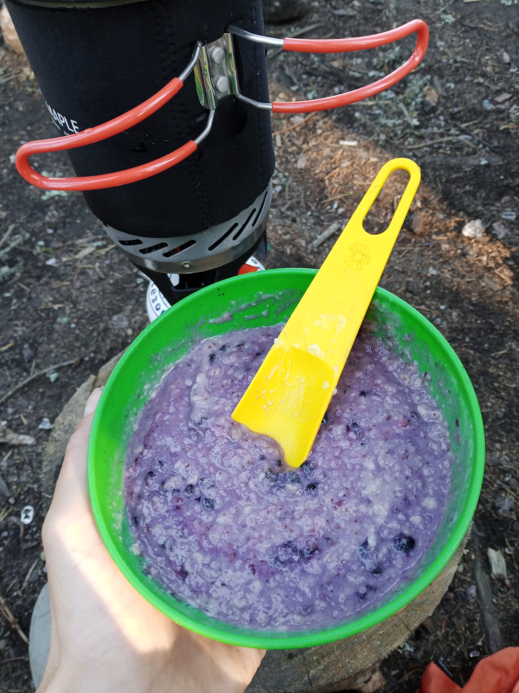

---

## День 2

Во второй день мы прошли 16 км. Начало второго дня было довольно диким, мы шли по затопленной дороге, нашли кустики голубики, далее вышли на заросшую дорогу, немного прошлись вдоль реки Уксуньоки по тропе, в середине дня вышли на обычную дорогу, по которой уже стали кататься туристы, в принципе дальше до трассы Сортавала, мы по ней и шли.

> 📷 *Болотце*

  

На обеде искупались в озере Лахнолампи, вода была прохладная. Далее шли по дороге. Наша стоянка оказалась занята, поэтому мы встали просто на берегу озера Ахвенъярви. Место оказалось очень приятным, палатку мы поставили на мягком мху, у озера была черника, голубика и даже совсем зеленая клюква. Придя на стоянку, мы поняли, что нам осталось около 42 км и идти их за 4 дня по такой дороге — очень странная затея, поэтому мы решили ускориться и пройти все за 2 дня, что оказалось хорошей идеей.

> 📷 *Стоянка второго дня*

  
  

> 📷 *Брусника*

  
  
  

---

## День 3

Сегодня мы решили идти 21 км, дорога до трассы «Сортавала» была такая же, как и раньше, после трассы был кусочек настоящей тропы, немного поднялись по курумнику, прошли между красивыми озерами, однако вскоре опять вышли на такую же дорогу (на велосипеде можно было бы эту тропу объехать). На подходе к озеру Плотина-Мустоярви (где у нас ночевка) оказался мемориал погибшей роте десантников. Вообще, оказалось, что в тех местах шли серьезные бои во время второй мировой, так что далее мы находили еще несколько мемориалов, а также противотанковое заграждение из камней.

> 📷 *Мемориал погибшей роте десантников*

  
  

Стоянка на озере была оборудованной, мы половили рыбу, довольно успешно.

> 📷 *Стоянка третьего дня*

  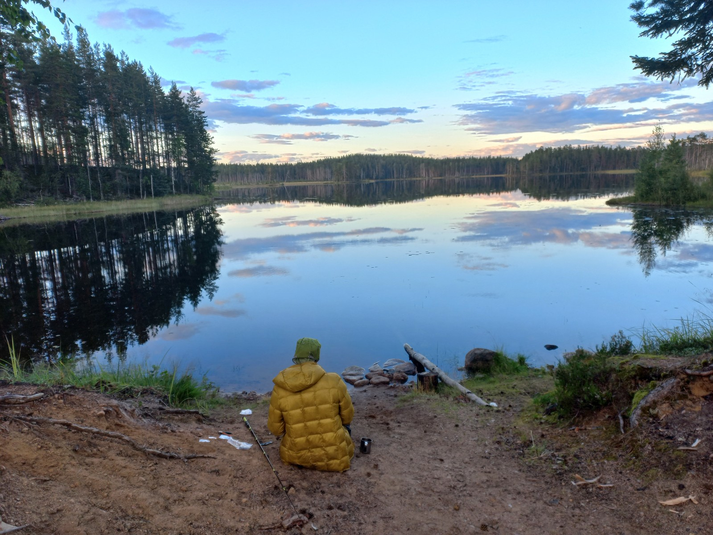

---

## День 4

В начале дня мы вышли на какое-то строящееся шоссе, по нему было идти неприятно, но через несколько километров мы с него ушли на уже привычную лесную дорогу.

> 📷 *Строящаяся дорога*

  

К вечеру вышли к водопадам «Белые мосты», водопады симпатичные, для туристов оборудовали мостики, столы и навесы, люди там были и вечером, и утром. Заночевали на подходе к водопадам.

> 📷 *Водопад «Белые мосты»*

  
  
  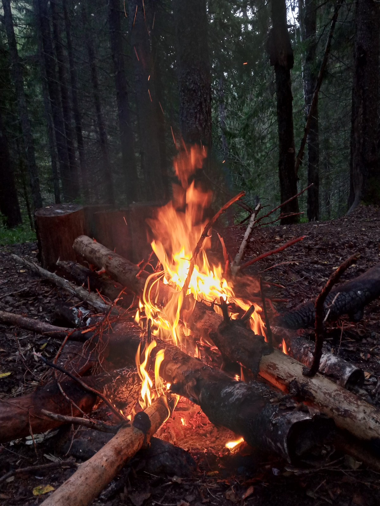

С утра пытались выехать в Сортавалу, и тут начинается раздел «Логистика 2».

---

## Логистика 2

План был такой: взять такси до Питкяранты, оттуда уехать на электричке в 12:00 в Сортавалу, но возникло две проблемы: на Белых мостах нету связи у Теле2 (хотя пишет, что сеть есть), и электричку отменили.

Итоговая логистика: мы дошли до места, где есть связь (километра 4 по дороге в сторону шоссе), вызывали машину до Питкяранты, оттуда на другой машине доехали, внезапно, до Рускеалы. Да, это в принципе входило в наши планы, но немного не в том порядке. В общем за 800+2000 рублей мы к 3 часам дня оказались на парковке горного парка Рускеала. Тут перед нами встал вопрос, что делать дальше.

---

## Что было дальше?

Так как мы вышли на 2 дня раньше, у нас были развязаны руки, выбирая между хостелом и платным кемпингом мы внезапно обнаружили на карте OSM бесплатный кемпинг на большущем мраморном карьере прямо напротив понтового горного парка, нас это очень заинтересовало и мы пошли туда. Оказалось, что это действительно большое и красивое озеро с лазурной водой, где люди в основном плавают на сапах и просто отдыхают, мы забрались повыше и встали там лагерем.

> 📷 *Мраморный карьер напротив горного парка*

  
  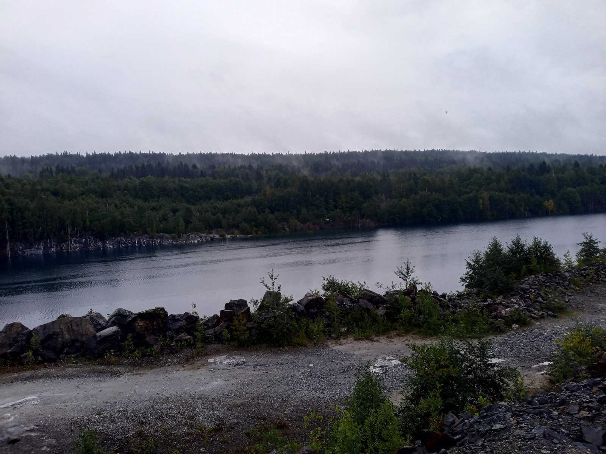

Взяв с собой самые ценные вещи, мы пошли в горный парк (20 минут пешком), поглазели на все, что они понастроили, заглянули на ЖД, узнать про поезда в Сортавалу и пошли домой.

> 📷 *Фрагменты горного парка*

  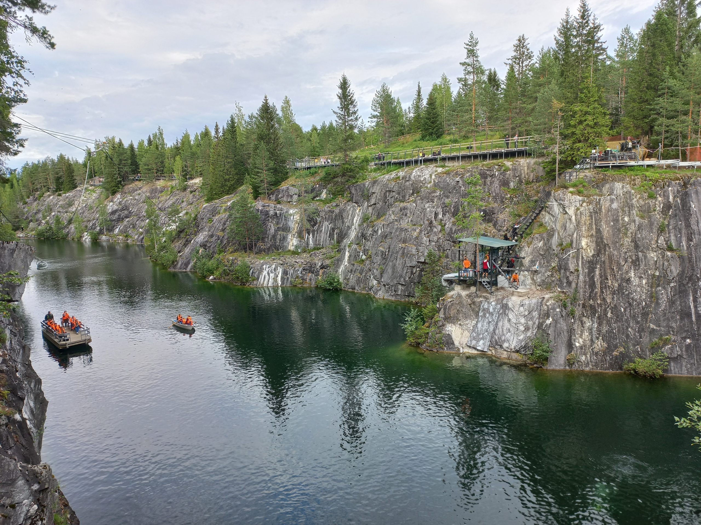
  
  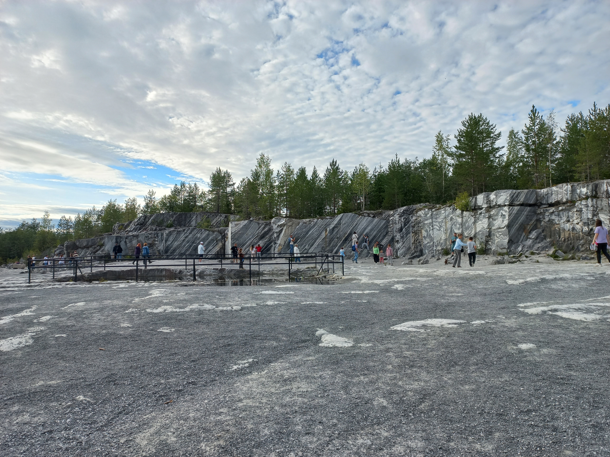
  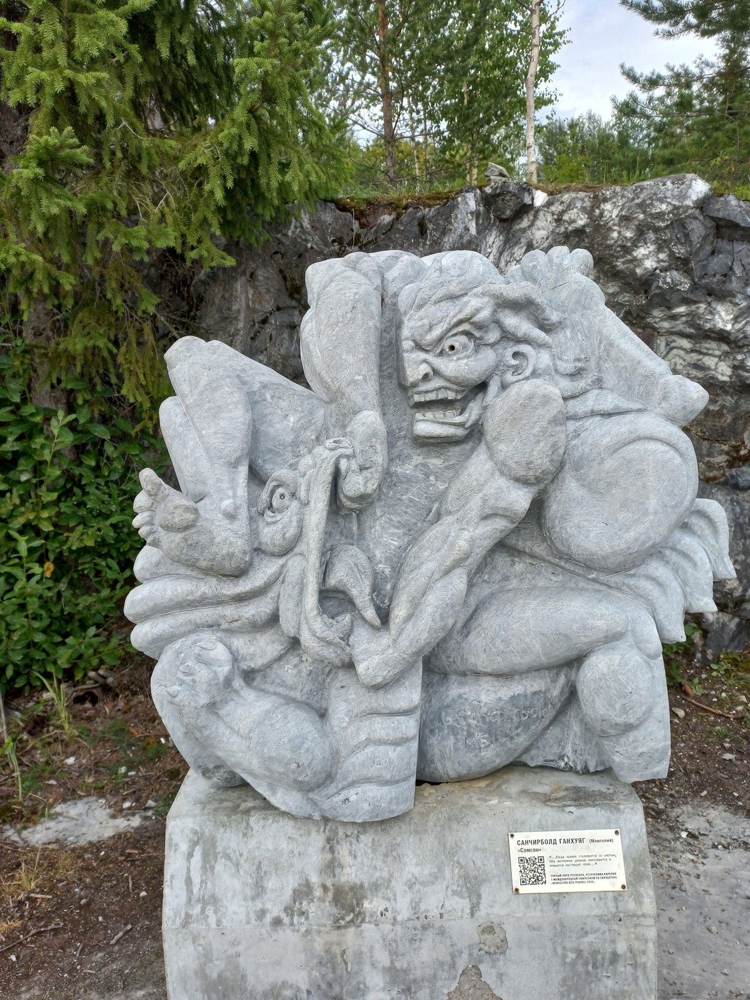

Следующий день у нас был уже последний, на вечер были взяты билеты до Москвы. Нам необходимо было доехать на электричке до Сортавалы, погулять по ней и спокойно уехать в Москву. Ночью зарядил дождик и капал весь день, что было не очень приятно, однако не сильно мешало нашим мероприятиям. Перед электричкой (14:10) было время и я попытался прогуляться вокруг карьера, однако вода в нем поднялась и половину дороги затопило.

> 📷 *Затопленная дорога*

  

Затем я слазал на мраморную гору, не нашел там мрамора и спустился обратно. Дальше было без приключений, мы посетили ретро-поезд (вагон ресторан), доехали до Сортавалы, прошлись до Финского кладбища, параллельно осматривая город и вернулись на вокзал. В 20:40 уехали домой.

> 📷 *Ретро-тягач*

  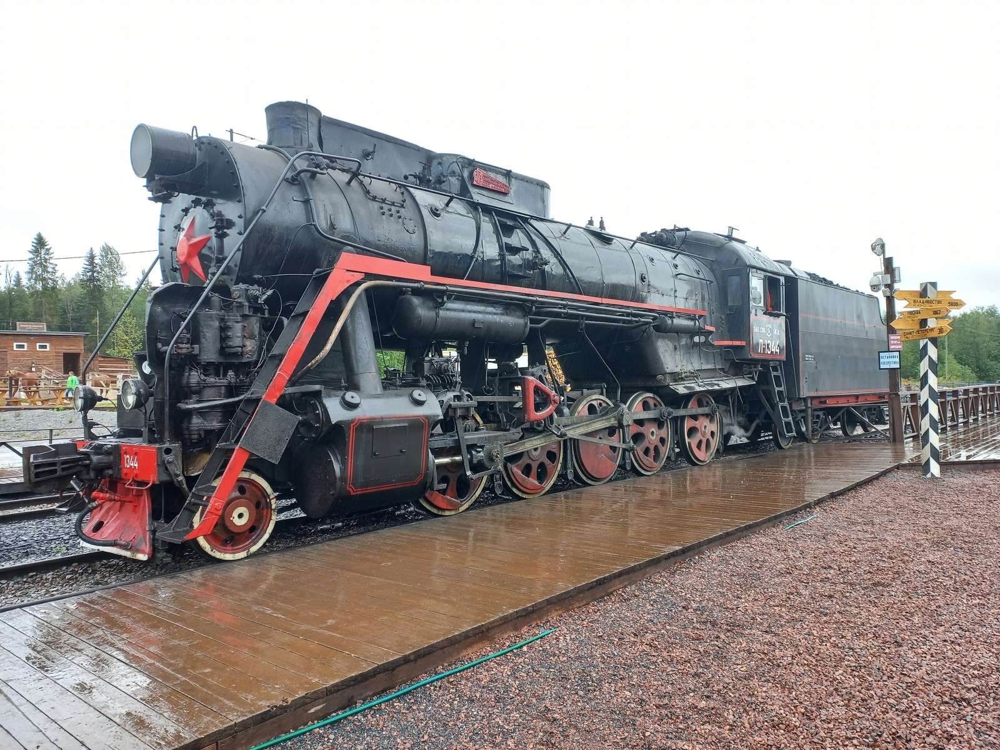
  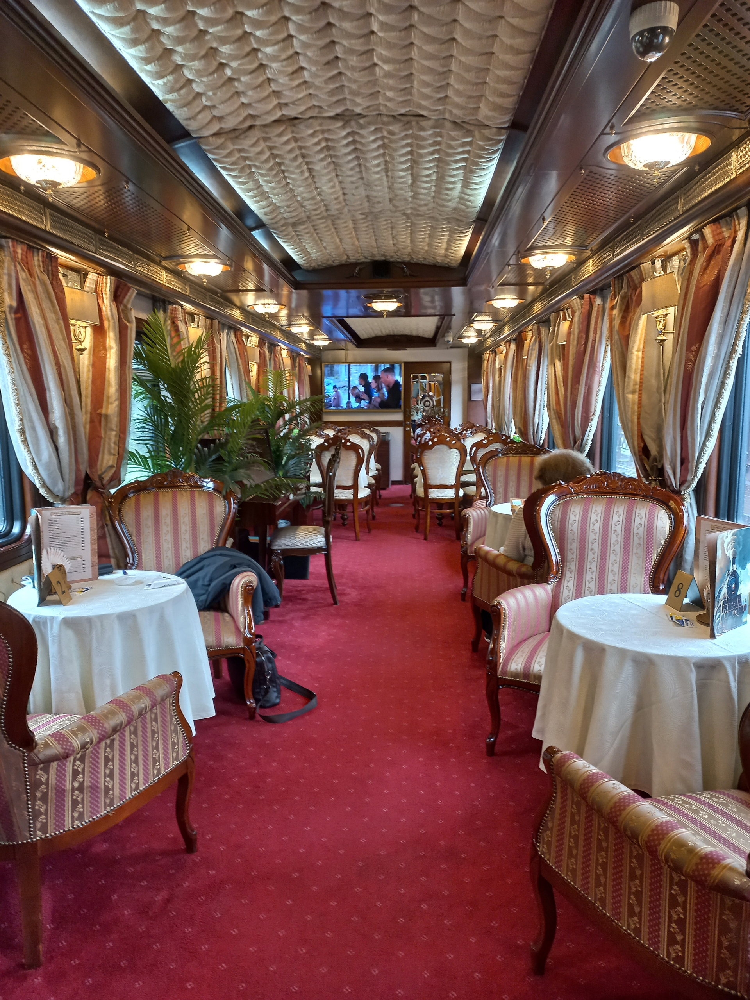
  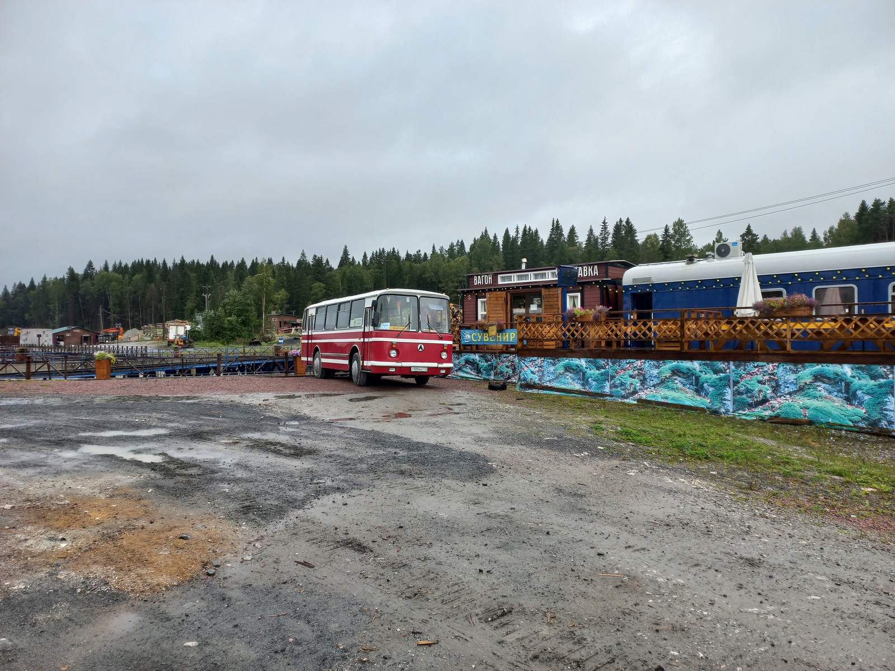

> 📷 *Мужской лицей (рядом похожее здание женского лицея)*

  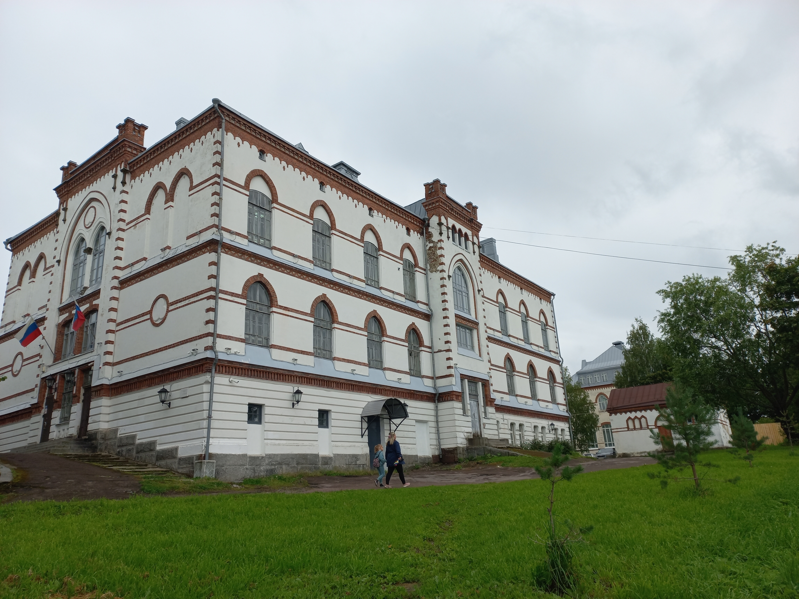
  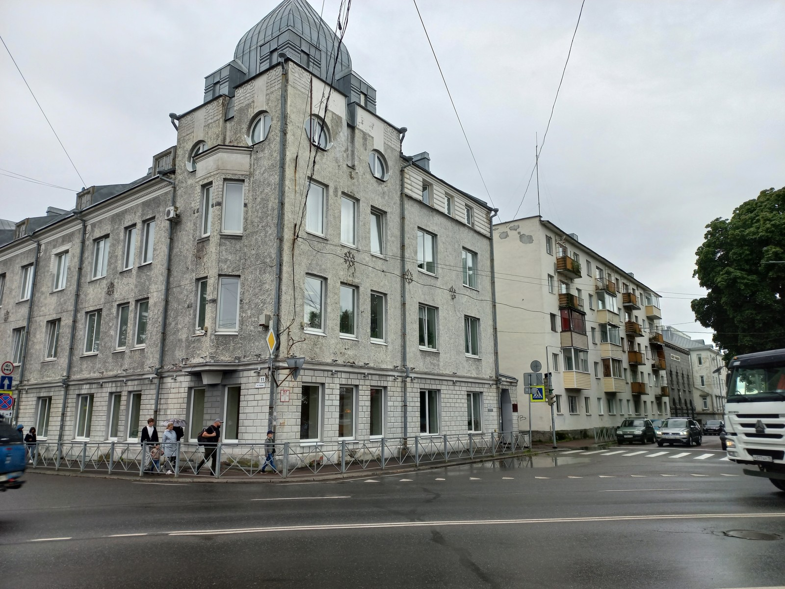
  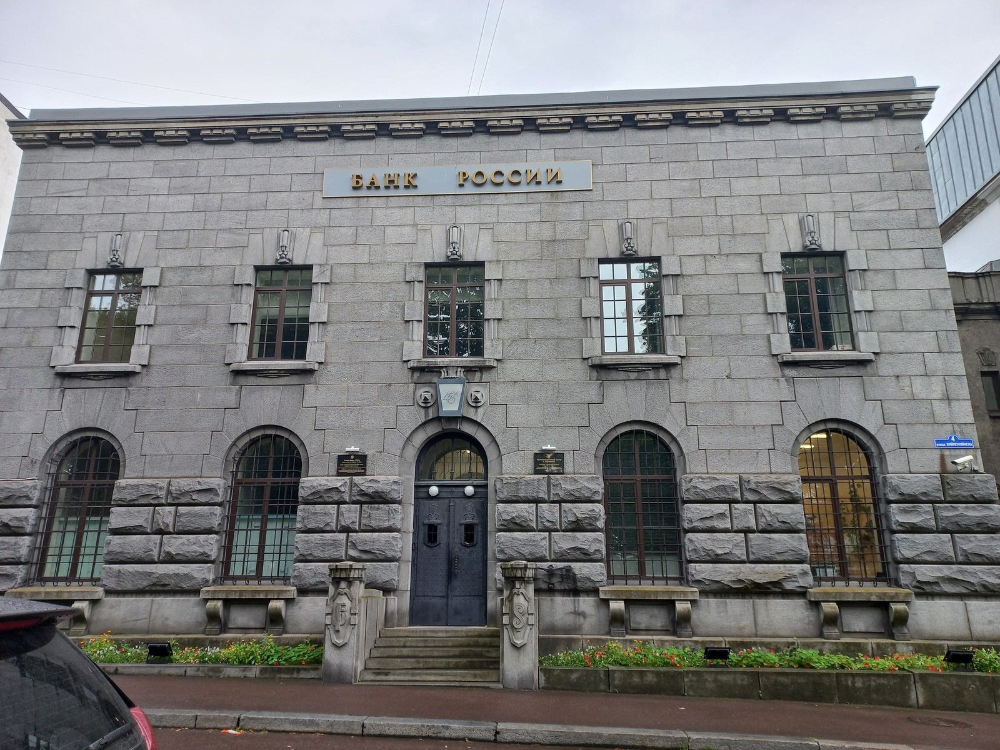

> 📷 *Антуражное надгробие на финском кладбище*

  
  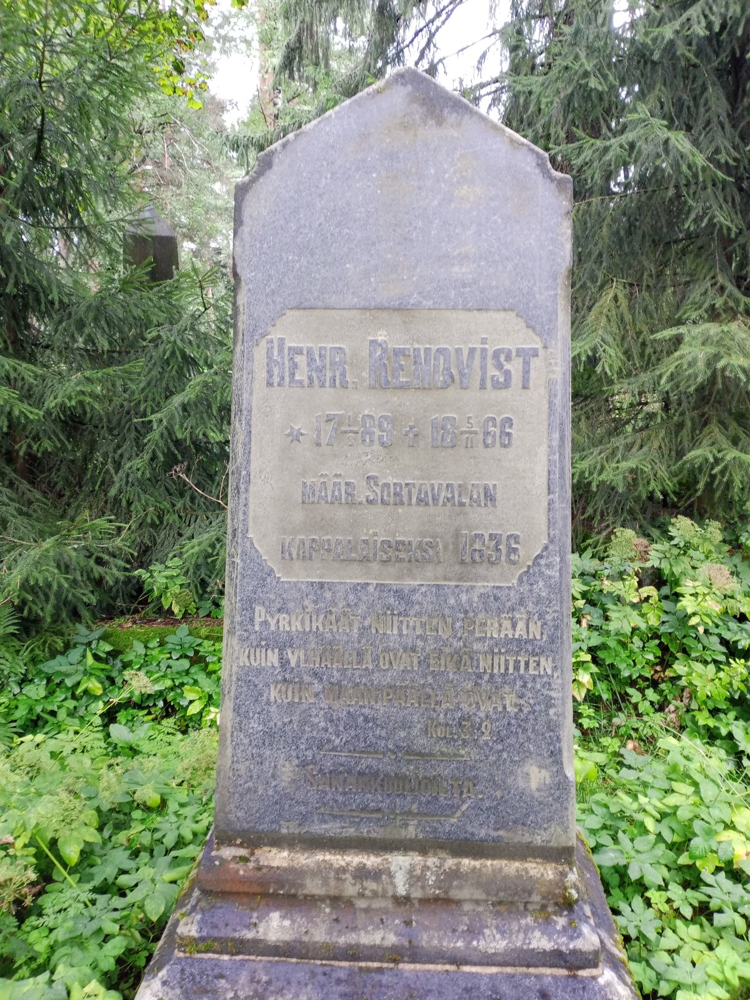
  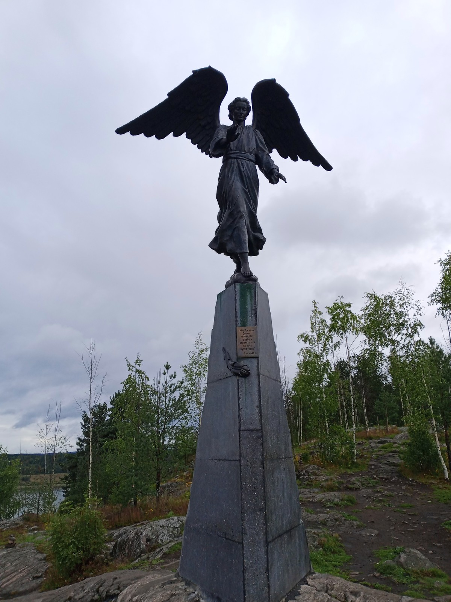

