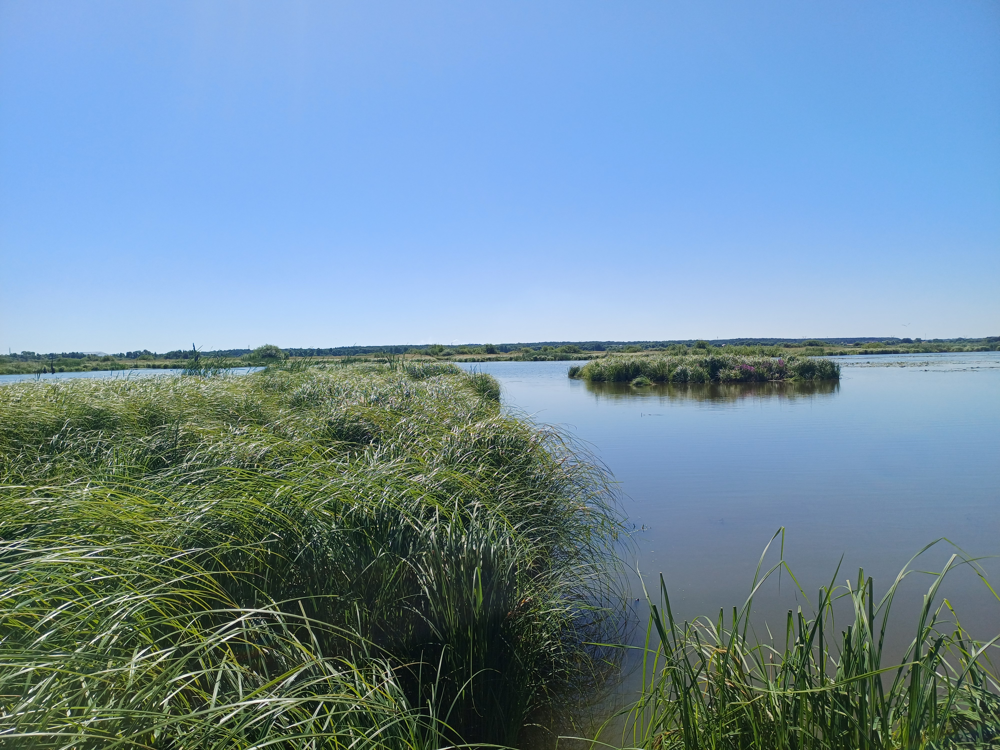

# Отчёт о походе по Москворецкому пойменному заказнику 18.07.2026

## О месте

Москворецкий пойменный заказник (он же Виноградовская и Фаустовская пойма) — одна из старейших и наиболее ценных в природном отношении особо охраняемых природных территорий Подмосковья, растянувшаяся по пойме Москвы-реки и реки Нерской между городскими округами Воскресенск и Раменское. Площадь — свыше 10 500 га, территория находится под наблюдением международной орнитологической организации BirdLife International: здесь гнездятся редкие птицы, а на пойменных лугах растут краснокнижные виды растений. Въезд автотранспорта официально запрещён — только пешие прогулки.

**Трек:** https://nakarte.me/#m=14/55.37911/38.64141&l=O&nktl=j7DBYRM1jaXXKtpDSk2JJw

**Кратко:** маршрут проходит через заболоченные участки, местами тропа теряется полностью, GPS работал раз в час, поэтому трек написан от руки, рекомендую ориентироваться на текстовое описание. Самый тяжёлый отрезок — между точками X8 и X10 (болото, высокая трава, кочки).

---

## X1
Сначала дорога идет вдоль СНТ, она покошена, но в какой-то момент она просто исчезла, и мы шли по высокой траве. У последнего дома нет забора, зато есть две собаки.

## X2
Начало тропы — хорошая, незаросшая дорога.

## X3
Сделали привал в беседке, пока отдыхали, подошел мужчина, спросил не рыбачим ли мы. Дальше пошли по тропе, вышли к водоёму — по сути на мыс, с которого некуда идти дальше (точка X3, фото 1). Подозреваю, что тут как раз рыбаки сидят, на сам мыс выйти не получилось, так как стало мокро. Пошли назад, вдоль канала (фото 2) искать переход.

## X4
Сначала от X3 мы шли по тропе назад, потом двигались X4 по кустам, на X4 канал заканчивается — вернее, не совсем заканчивается, но там отличный переход, бетонные плиты, раньше явно была дорога. После перехода дороги нет никакой, так же мокрое поле, трава по макушку (фото 3).

## X5
Вернулись на тропу — уже заметно более заросшую, но всё ещё различимую. Развилку X5' не нашли, дорога как будто идет только влево. Трава во многих местах примята и за нее цепляются ноги, надо идти аккуратно.

## X6
При подходе к  точке X6 тропа почти пропала, на самой точке — пропала совсем. Попробовали срезать напрямик к параллельной тропе, но между нашей тропой и той оказался широкий канал — вернулись на трек. До X7 тропа формально есть (фото 4), но её нужно скорее нащупывать ногами, глазами не видно.

## X7
Поворот тропы виден отчётливо — вот так она выглядит в том месте (фото 5).

## X7'
Тропа с X7 ведёт к каналу, но моста здесь нет — мост левее (виден, если подойти к каналу и повернуть голову влево). Переход — по импровизированному мосту (фото 7, 8). Ориентир — дерево, свисающее над водой (фото 6).

## X8
До этой точки тропа уже совсем плохая — нужно напрягаться, чтобы её разглядеть, да и ногами ее не чувствуется вообще, но все равно, лучше уж идти по такому, чем по полю. Дальше тропа пропадает полностью и появится снова только после X10 (и то не сразу). Вместо тропы — высокая трава, крупные кочки, заболоченные участки, где нужно аккуратно выбирать, куда ступать. Все тропы здесь автомобильные — ориентируйтесь на две колеи. На самой X8 упёрлись в болото, обошли слева.

## X9
Отличный переход.

## X10
Сразу после X9 — очередное болото, обошли справа. На X10 снова хороший переход (фото 11). После перехода вдоль канала (направо) идёт тропа (хорошо видна на спутнике), но в нужную нам сторону тропы сначала не было — нашлась метров через 100. Болота там уже заканчиваются, идти наконец-то комфортно, тропа отчетливо различима ногами. Самый тяжёлый участок — X8–X10 (возможно, начинается чуть раньше).

## X11
Можно подойти к реке Нерской.

## X12
Тролльный мостик (фото 12). Мост есть, но он полностью под водой, глубина по щиколотку.

---

## Итоги
Летом проходится сносно, весной в половодье нереально, осенью я бы надел сапоги или неопрен.
